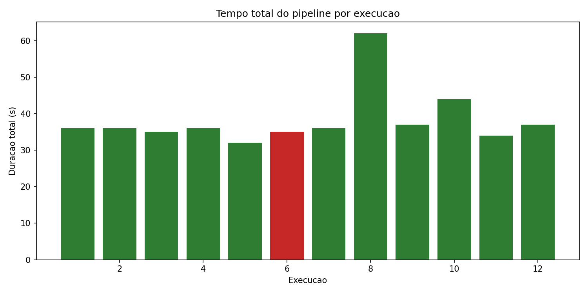
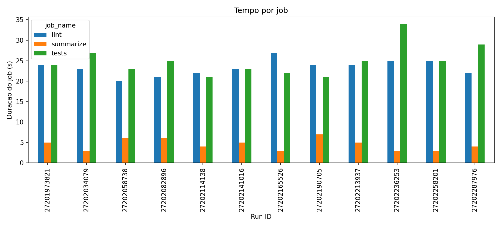
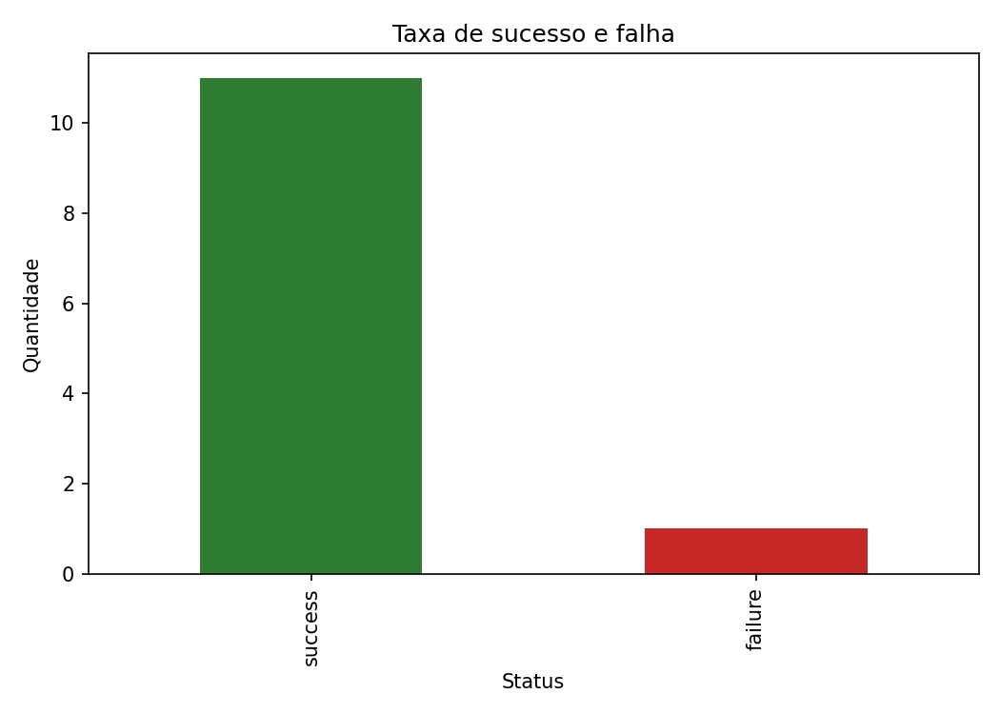
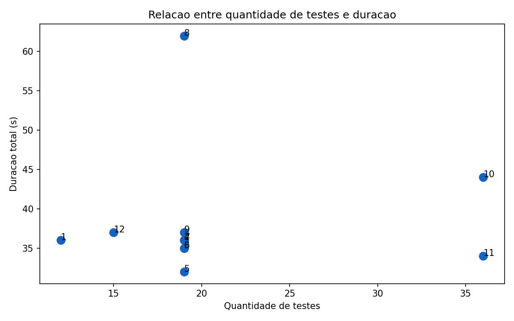

# Relatorio tecnico do experimento CI/CD

## Contexto

Este repositorio contem uma CLI simples de ASCII art em Python. O pipeline no
GitHub Actions executa instalacao de dependencias, lint com Ruff, testes com
Pytest, geracao de artefatos e publicacao de metadados da execucao.

- Repositorio: https://github.com/odanielaugusto/Ponderada_Hermano_ASCII
- Workflow YAML: https://github.com/odanielaugusto/Ponderada_Hermano_ASCII/blob/main/.github/workflows/ci.yml
- Script de coleta: `scripts/collect_metrics.py`
- Base gerada: `entregaveis/metricas_pipeline.csv`
- Graficos: `entregaveis/graficos/`

## Hipotese inicial

1. O cache de dependencias reduziria a duracao do pipeline.
2. Jobs paralelos seriam mais rapidos que jobs sequenciais.
3. Aumento da quantidade de testes e testes lentos aumentariam a duracao total.
4. Falhas controladas apareceriam como status `failure` sem impedir a coleta de
   dados do run.

## Execucoes reais

Foram coletadas 12 execucoes reais do GitHub Actions em 9 de junho de 2026.

| Run | Run ID | Status | Commit | Variacao | Link |
| --- | --- | --- | --- | --- | --- |
| 44 | 27201973821 | success | 944729b | baseline | https://github.com/odanielaugusto/Ponderada_Hermano_ASCII/actions/runs/27201973821 |
| 45 | 27202034079 | success | 0da49f8 | mais testes gerados | https://github.com/odanielaugusto/Ponderada_Hermano_ASCII/actions/runs/27202034079 |
| 46 | 27202058738 | success | 5b7f6a2 | teste lento de 1200 ms | https://github.com/odanielaugusto/Ponderada_Hermano_ASCII/actions/runs/27202058738 |
| 47 | 27202082896 | success | 100fbb9 | cache de pip removido | https://github.com/odanielaugusto/Ponderada_Hermano_ASCII/actions/runs/27202082896 |
| 48 | 27202114138 | success | 5b0c924 | cache de pip restaurado | https://github.com/odanielaugusto/Ponderada_Hermano_ASCII/actions/runs/27202114138 |
| 49 | 27202141016 | failure | 544539e | falha controlada em teste | https://github.com/odanielaugusto/Ponderada_Hermano_ASCII/actions/runs/27202141016 |
| 50 | 27202165526 | success | 9304709 | correcao da falha | https://github.com/odanielaugusto/Ponderada_Hermano_ASCII/actions/runs/27202165526 |
| 51 | 27202190705 | success | 76bc990 | jobs sequenciais | https://github.com/odanielaugusto/Ponderada_Hermano_ASCII/actions/runs/27202190705 |
| 52 | 27202213937 | success | 063ec5f | jobs paralelos restaurados | https://github.com/odanielaugusto/Ponderada_Hermano_ASCII/actions/runs/27202213937 |
| 53 | 27202236253 | success | 814e89d | conjunto maior de testes | https://github.com/odanielaugusto/Ponderada_Hermano_ASCII/actions/runs/27202236253 |
| 54 | 27202258201 | success | db342b5 | teste lento mais intenso | https://github.com/odanielaugusto/Ponderada_Hermano_ASCII/actions/runs/27202258201 |
| 55 | 27202287976 | success | d498cb8 | perfil final estavel | https://github.com/odanielaugusto/Ponderada_Hermano_ASCII/actions/runs/27202287976 |

## Dados coletados

O CSV contem `run_id`, commit, mensagem do commit, status, duracao total do
workflow, duracao por job, duracao por etapa, quantidade de testes, falhas,
tempo medio aproximado dos testes, timestamp, cenario e link do run.

Resumo por execucao:

| Run | Cenario | Status | Duracao total (s) | Testes | Falhas |
| --- | --- | --- | ---: | ---: | ---: |
| 44 | baseline | success | 36 | 12 | 0 |
| 45 | more-tests | success | 36 | 19 | 0 |
| 46 | slow-tests | success | 35 | 19 | 0 |
| 47 | cache-off | success | 36 | 19 | 0 |
| 48 | cache-restored | success | 32 | 19 | 0 |
| 49 | controlled-failure | failure | 35 | 19 | 1 |
| 50 | failure-fixed | success | 36 | 19 | 0 |
| 51 | sequential-jobs | success | 62 | 19 | 0 |
| 52 | parallel-restored | success | 37 | 19 | 0 |
| 53 | large-test-set | success | 44 | 36 | 0 |
| 54 | heavier-slow-test | success | 34 | 36 | 0 |
| 55 | stable-final | success | 37 | 15 | 0 |

## Graficos gerados

- `graficos/tempo_total_por_execucao.png`
- `graficos/tempo_por_job.png`
- `graficos/taxa_sucesso_falha.png`
- `graficos/testes_vs_duracao.png`









## Analise

### Qual etapa mais contribuiu para o tempo total do pipeline?

A etapa com maior media foi `Install dependencies`, com media de 16,12 s e maximo
de 18 s. Por job, `tests` teve media de 24,92 s e `lint` ficou proximo, com
23,33 s. Isso mostra que o gargalo principal nao foi o codigo de teste em si,
mas o custo repetido de preparar ambiente e instalar dependencias.

### Houve diferenca significativa entre execucoes com e sem cache?

No par observado, `cache-off` levou 36 s e `cache-restored` levou 32 s. Houve
economia de 4 s, mas a amostra e pequena demais para afirmar significancia
estatistica. O resultado sugere ganho, porem precisa de mais repeticoes.

### O paralelismo reduziu o tempo total? Em que condicoes?

Sim. O run com jobs sequenciais levou 62 s, enquanto o paralelo restaurado levou
37 s. A reducao foi de 25 s. O ganho ocorreu porque lint e testes sao
independentes e podem compartilhar o tempo de espera de setup em runners
separados.

### Quais falhas foram mais frequentes?

Houve uma falha em 12 execucoes, no run 49. Ela foi intencional, causada pelo
perfil `controlled-failure`, que ativa uma assercao de falha no teste. A taxa de
sucesso foi 91,67%.

### O pipeline fornece feedback rapido o suficiente para o desenvolvedor?

Sim para um projeto pequeno. A mediana foi 36 s e a media foi 38,33 s. O ponto de
atencao e o modo sequencial, que subiu para 62 s e mostra como uma configuracao
ruim pode atrasar feedback mesmo em projeto simples.

### Que melhorias poderiam ser feitas no pipeline?

As melhorias mais diretas seriam manter jobs paralelos, reduzir instalacao de
dependencias, fixar melhor cache e separar coleta de metricas em um workflow
manual ou agendado apos a conclusao dos runs. Tambem seria util publicar um CSV
por run como artefato para eliminar inferencias locais.

### Quais limitacoes existem nos dados coletados?

A amostra tem apenas 12 execucoes e usa runners hospedados pelo GitHub, sujeitos a
variacao externa. Sem token local, a API publica permitiu coletar runs/jobs, mas
nao baixar o ZIP dos artefatos, que retornou 401. Por isso, `test_count` e
`test_failures` foram inferidos a partir do `experiment/profile.json` de cada
commit real, e `test_average_time` foi aproximado pela duracao da etapa
`Run Pytest` dividida pela quantidade de testes.

### Como essa analise poderia apoiar decisoes de engenharia?

Ela mostra onde o feedback e gasto: preparacao de ambiente, organizacao dos jobs
e volume de testes. Com esses dados, a equipe pode decidir se vale otimizar cache,
manter paralelismo, separar suites lentas ou investir em runners mais rapidos.

## Resultados inesperados

1. O run `slow-tests` nao ficou mais lento que `more-tests`: 35 s contra 36 s.
   Isso provavelmente ocorreu por variacao do runner e pela resolucao em segundos
   das etapas do GitHub Actions.
2. O run `heavier-slow-test`, com 36 testes e atraso maior, levou 34 s, menos que
   `large-test-set`, que levou 44 s. Isso indica que o tempo total foi dominado
   por ambiente/setup e variabilidade externa, nao apenas pelo tempo artificial
   do teste.

## Comparacao entre hipotese e resultado observado

A hipotese sobre paralelismo foi confirmada com clareza: 62 s sequencial contra
37 s paralelo. A hipotese sobre cache teve indicio favoravel, mas precisa de mais
dados: 36 s sem cache contra 32 s com cache. A hipotese sobre testes lentos e
quantidade de testes foi apenas parcialmente observada, porque a variabilidade do
runner mascarou alguns efeitos esperados.

## Como reproduzir

```powershell
python -m venv .venv
.\.venv\Scripts\Activate.ps1
pip install -e ".[dev]"
ruff check .
pytest --junitxml=artifacts/junit.xml
python scripts/collect_metrics.py `
  --repo odanielaugusto/Ponderada_Hermano_ASCII `
  --workflow ci.yml `
  --limit 12 `
  --out entregaveis/metricas_pipeline.csv
python scripts/generate_charts.py `
  --input entregaveis/metricas_pipeline.csv `
  --out-dir entregaveis/graficos
```

Para baixar os artefatos `run-metadata.json` diretamente da API, defina
`GITHUB_TOKEN`. Sem token, o script usa os commits reais do clone local como
fallback para preencher dados de teste.
